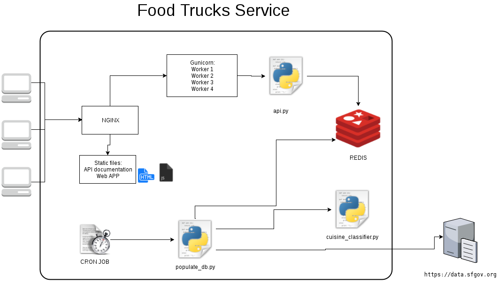

# Food truck project

## Link to to the hosted application

 - API is available here: http://srand.fr/v1/
 - Demo application: http://srand.fr/

## Description of the problem and solution.

The objective is to provide a service that allows to get the food trucks that are close to a specific location in San Francisco.

## Proposed solution

The proposed solution focuses on back-end and provides the following features:
  - Ability to get food trucks in a radius around a specific target point
  - Ability to search for food trucks with a specific cuisine (e.g asian food)

It is based on :
  - Python hug framework (REST API framework)
  - REDIS for the database
  - NGINX/GUNICORN to serve the users
  - Cron job to update the database daily

The choice of REDIS was motivated by the fact that the number of entry is small (less than 1000 food trucks, which fit in memory). Moreover
REDIS provides an efficient GEORADIUS method which is particularly usefull here.
The introduction of specific indexes (e.g status index, cuisines index) allows to speedup lookup of food trucks.

To develop the REST API I choose to use the hug framework as it seems to be a light and simple framework.

To update the local database I choose to use a simple cron job. It is run once a day: it downloads new registred food truck information and updated schedules. The source datasets are:
  - trucks: https://data.sfgov.org/resource/6a9r-agq8.json
  - schedules: https://data.sfgov.org/resource/bbb8-hzi6.json

In order to associate cuisine types to each food truck we build a simple classifier that match fooditems with fooditems usually associated to a specific cuisine (see *cuisine_classifier.py*).

### Tests

To validate that the service behaves correctly the following tests were defined:
  - Unit tests: using python unittest and a mock redis
  - Integration tests: using pyresttest
  - Stress tests: I choose to use locustio to validate that the API is able to handle simple scenario with numerous users (e.g 100 users with 1 requests per second)

The tests run on the proposed solutions tends to confirm that the technical choices were relevant: handling more
than 500 requests per seconds on a desktop computers.

# Installation

Docker containers are used to facilitate the deployment of the system (see docker-compose file):
  - clone the repository
  - docker-compose build
  - docker-compose up

## What could be improved ?

  - The cuisine classifier could benefit of the use machine learning techniques and database like https://www.kaggle.com/kaggle/recipe-ingredients-dataset.
  - A feature that may be useful could be to be able to determine if a food truck is opened at a specific time

